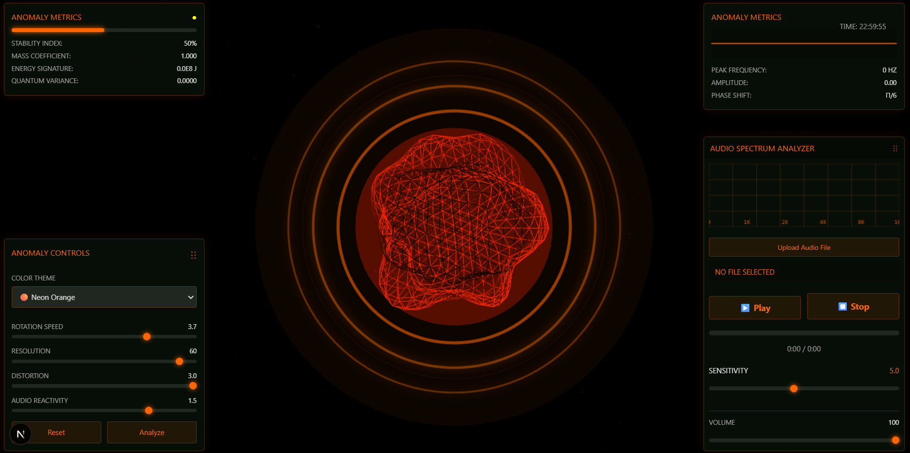
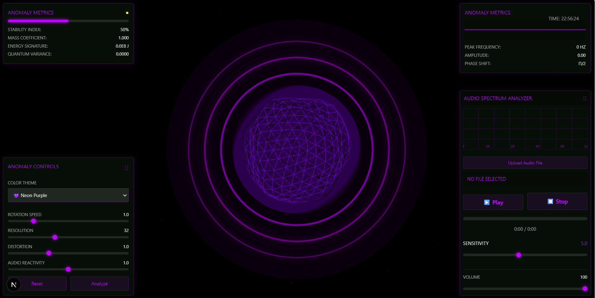

# 🎵 Audio Visualizer - 3D Interactive Experience

An immersive 3D audio visualization application built with Next.js, Three.js, and Web Audio API.

## ✨ Features

### 🎨 Visual Effects
- **3D Anomaly Object**: Interactive distorting sphere that reacts to audio
- **Circular Visualizer**: Multi-ring frequency visualization
- **Spectrum Analyzer**: Real-time frequency spectrum display
- **Floating Particles**: 1000+ animated background particles
- **Dynamic Waveform**: Time-domain audio visualization

### 🎛️ Audio Controls
- **Play/Pause**: Control audio playback with visual feedback
- **Stop**: Stop and reset audio to beginning
- **Progress Bar**: Click to seek to any position in the track
- **Volume Control**: Adjustable audio volume (0-100%)
- **Time Display**: Current time / Total duration
- **Audio Sensitivity**: Adjust visualization responsiveness (1-10x)

### 🎯 Interactive Features
- **Drag & Drop Panels**: All UI panels are draggable
- **Anomaly Interaction**: Click and drag the 3D anomaly object
- **Camera Control**: Orbit controls with auto-zoom on audio playback
- **Real-time Metrics**: Live stability, mass, energy, and quantum variance readings

### ⚙️ Customization Options
- **Rotation Speed**: Control anomaly rotation (0-5x)
- **Resolution**: Adjust wireframe detail (12-64)
- **Distortion**: Modify shape distortion (0-3x)
- **Audio Reactivity**: Fine-tune audio response (0-2x)
- **Color Themes**: 10 preset themes + custom color picker
  - 🟢 Neon Green (default)
  - 🔵 Neon Blue
  - 🟣 Neon Pink
  - 💜 Neon Purple
  - 🟠 Neon Orange
  - 🔴 Neon Red
  - 🟡 Neon Yellow
  - 🔷 Cyber Cyan
  - 💚 Matrix Green
  - 🎨 Custom Color (pick any color you want!)

## 🚀 Quick Start

### Prerequisites
- Node.js 18+ or 20+
- npm, yarn, or pnpm

### Installation
```bash
# Install dependencies
npm install

# Run development server
npm run dev

# Open browser to http://localhost:3000
```

### Production Build
```bash
# Build for production
npm run build

# Start production server
npm run start
```

## 🎮 How to Use

1. **Load Audio**: Click "Upload Audio File" and select an MP3, WAV, or other audio file
2. **Control Playback**: Use Play/Pause and Stop buttons
3. **Adjust Volume**: Drag the volume slider (0-100%)
4. **Seek Position**: Click anywhere on the progress bar
5. **Change Theme**: Select from dropdown or pick custom color
   - Choose a preset theme from the dropdown
   - Or select "Custom Color" and use the color picker
   - Theme applies instantly to all visuals!
6. **Customize Visuals**: Adjust sliders in the control panel
7. **Interact**: Drag the 3D anomaly object with your mouse
8. **Move Panels**: Drag panels by their handles (⋮⋮)

## 📊 Visualization Panels

### Anomaly Metrics (Top Left)
- Stability Index
- Mass Coefficient
- Energy Signature
- Quantum Variance

### Waveform Panel (Top Right)
- Real-time waveform
- Peak Frequency
- Amplitude
- Phase Shift

### Spectrum Analyzer (Bottom Right)
- Frequency spectrum (0-16kHz)
- Audio controls
- Sensitivity adjustment
- Volume control
- Progress tracking

### Control Panel (Bottom Left)
- Color Theme selector
- Rotation Speed
- Resolution
- Distortion
- Audio Reactivity
- Reset & Analyze buttons

## 🎨 Screenshots

**Initialization**


**Detail**


## 🛠️ Technology Stack

- **Next.js 16** - React framework
- **React 19** - UI library
- **Three.js** - 3D graphics
- **@react-three/fiber** - React renderer for Three.js
- **@react-three/drei** - Three.js helpers
- **GSAP** - Animation library
- **Web Audio API** - Audio analysis
- **TypeScript** - Type safety
- **Tailwind CSS** - Styling

## 🎵 Supported Audio Formats

- MP3
- WAV
- OGG
- M4A
- FLAC
- And other browser-supported formats

## ⚠️ Browser Requirements

- Modern browser with WebGL support
- Audio autoplay permission (click page to enable)
- Recommended: Chrome, Edge, Firefox (latest versions)

## 🐛 Troubleshooting

### Audio doesn't play
- Click anywhere on the page to initialize audio context
- Check browser autoplay permissions
- Ensure audio file format is supported

### WebGL errors
- Update graphics drivers
- Try a different browser
- Check chrome://gpu for WebGL status

### Performance issues
- Lower the Resolution slider (12-32)
- Reduce particle count in code
- Close other browser tabs

## 📝 License

MIT License - Feel free to use and modify!

## 🤝 Contributing

Contributions welcome! Please feel free to submit pull requests.

---

Made with ❤️ using Next.js, Three.js, and Web Audio API
